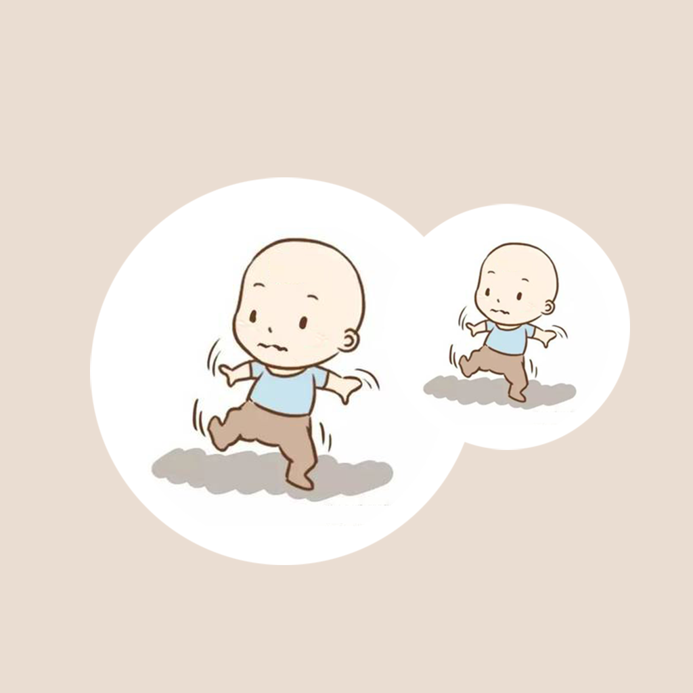

## Welcome to Baby Balanced Learning Record 

Our baby's balance ability will greatly help the baby's future growth and learning. As parents and family members of our babies, we hope that our babies can learn to balance well. Do you remember when your baby first learned to balance? For example, when a baby can crawl and stand on its own, it needs to learn to balance first. We can help your baby learn the ability to balance, such as supporting the baby to stand, and record the details of the baby's emotions at the time, the balance method and the time of continuous balance. We can organize this information into a list and analyze how to more effectively help your baby learn to balance as early as possible.

If you have any questions, you can either leave a message or send the questions to our email address.

We will answer them for you in the first time.

### Address: jichungan9498@163.com

Thank you!
